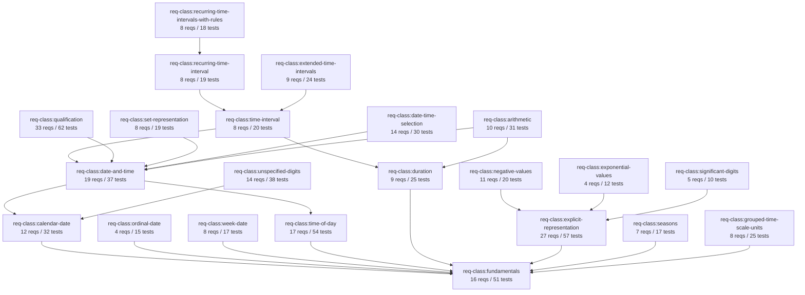

# TODO.up/00 — Dependency Graph for the ISO 8601 Test Suite

**Status:** REFERENCE (not a work item — index for the work items below)

This document maps every dependency relation in the test suite so the restructuring work in `TODO.up/01` through `TODO.up/13` can be ordered correctly. Generated by direct inspection of `requirements/`, `tests/`, `profiles/`, `results/`, and the `lib/test_suite/suite_index.rb` index.

---

## 1. Five-Layer Topology

```
ISO 8601-1:2026 / ISO 8601-2:2026
        │
        ▼
   9 Profiles          (profile:id → list of conf-classes)
        │
        ▼
  22 Conformance       (conf-class:id ← 1:1 → req-class:id)
   Classes                Each req-class declares dependencies on others
        │
        ▼
 259 Requirements      (req:id, atomic per Clause 3.x/4.x/5.x of standard)
   (51 phantom refs    (test files reference reqs not yet declared)
    from tests)
        │
        ▼
 728 Conformance       (conf-test:id → one or more req:id)
   Tests                  46 composite tests reference ≥2 reqs
        │
        ▼
 24 Adapter Results    (one YAML per adapter, 728 outcomes each)
   (result:id)            ×24 = 17,472 individual test outcomes
```

---

## 2. Req-Class Dependency DAG (Mermaid)



**Cycle check**: DAG confirmed — no cycles (verified via `GraphUtil.detect_cycles`).

---

## 3. Profile → Conformance-Class Inclusion Matrix

| Profile | Conf-classes included | Notes |
|---|---|---|
| `profile:iso-8601-1-basic-format` | 6 | Subset of Part 1 |
| `profile:iso-8601-1-core` | 4 | Subset of Part 1 |
| `profile:iso-8601-1-complete` | 9 | All Part 1 classes |
| `profile:iso-8601-2-complete` | 22 | All Part 1 + Part 2 |
| `profile:rfc-3339` | 3 | Internet profile |
| `profile:w3c-datetime` | 2 | Web profile |
| `profile:edtf-level-0` | 4 | EDTF Level 0 |
| `profile:edtf-level-1` | 7 | EDTF Level 1 |
| `profile:edtf-level-2` | 10 | EDTF Level 2 |

Every change to a req-class's req list ripples into every profile that includes it. The two `*-complete` profiles will absorb the bulk of the new reqs from this restructuring.

---

## 4. Test → Requirement Mapping (key observations)

### 4.1 Composite tests (46 of 728, 6.3%)

These reference 2+ reqs in a single test. When any of those reqs splits, the test must be re-evaluated:

| Composite test pattern | Count | Example |
|---|---|---|
| Equivalence (basic ↔ extended) | 6 | `conf-test:cal-date-equiv-001` |
| Duration reduced+time-designator | 14 | `conf-test:dur-parse-005` |
| Profile-specific (basic-format, edtf-*) | 22 | `conf-test:basic-format-compact-calendar` |
| Other multi-req | 4 | `conf-test:dur-parse-001` |

### 4.2 Phantom requirements (51)

Referenced from tests but **not declared** in any `requirements/` file. Two origins:

- **Profile-specific reqs** (~30): `req:basic-format-compact-calendar`, `req:edtf-level-0-*`, `req:w3c-datetime-six-permitted-forms`, `req:rfc-3339-*` — these are declared in profile files (under `additional_requirements:`), not in req-classes. Legitimate.
- **Truly missing reqs** (~21): need declaration somewhere. Examples: `req:basic-format-no-delimiters`, `req:edtf-level-1-qualification-markers`, `req:edtf-level-1-season-codes`, etc.

### 4.3 Most-tested requirements (high-coverage targets)

These will be impacted most by splits — every split must preserve all existing tests:

| Tests | Requirement | Will split? |
|---|---|---|
| 14 | `req:cal-date-basic-full` | No |
| 13 | `req:qualification-calendar-date-complete` | Maybe (4.4.1 variants) |
| 10 | `req:unspecified-anywhere-calendar-date` | Yes (split per Clause 9.3 forms) |
| 10 | `req:grouped-application-date` | Yes (split per 5.4.1–5.4.4) |
| 9 | `req:ord-date-basic-full` | No |
| 9 | `req:days-per-month` | No |
| 8 | `req:time-utc` | Yes (split into 5 per 5.3.4) |
| 8 | `req:explicit-time-shift` | Yes (split into 4 per 7.4) |
| 7 | `req:time-ending-of-day` | Yes (split per 5.3.3 forms) |
| 7 | `req:explicit-omission-zero` | Yes |

---

## 5. Restructuring Migration Map

Each bundled req below will split into N atomic reqs. The "Tests to re-map" column shows which test files need updating when the split lands.

| Bundled req | File | Clause | Split into | Tests to re-map |
|---|---|---|---|---|
| `req:time-shift` | fundamentals.yaml | 4.3.13 | 5: `time-shift-basic-hm`, `time-shift-basic-h`, `time-shift-extended-hm`, `time-shift-utc`, `time-shift-plus-mandatory` | tests/8601-1/fundamentals.yaml (5 tests) |
| `req:time-utc` | time-of-day.yaml | 5.3.4 | 5: `time-utc-basic-full`, `time-utc-basic-hm`, `time-utc-basic-h`, `time-utc-extended-full`, `time-utc-extended-hm` | tests/8601-1/time-of-day.yaml (8 tests) |
| `req:time-offset-basic` | time-of-day.yaml | 5.3.5.2 | 2: `time-offset-basic-hm`, `time-offset-basic-h` | tests/8601-1/time-of-day.yaml |
| `req:time-offset-extended` | time-of-day.yaml | 5.3.5.2 | 2: `time-offset-extended-hm`, `time-offset-extended-h` | tests/8601-1/time-of-day.yaml (7 tests) |
| `req:time-beginning-of-day` | time-of-day.yaml | 5.3.3 | 6: `time-bod-basic-full`, `time-bod-extended-full`, `time-bod-basic-reduced-hm`, `time-bod-extended-reduced-hm`, `time-bod-basic-reduced-h`, `time-bod-extended-reduced-h` | tests/8601-1/time-of-day.yaml |
| `req:time-ending-of-day` | time-of-day.yaml | 5.3.3 | 6: mirror of beginning | tests/8601-1/time-of-day.yaml (7 tests) |
| `req:time-designator-omission` | time-of-day.yaml | 5.3.6 | 3: `time-designator-omittable`, `time-designator-required-to-disambiguate`, `time-designator-not-needed-extended` | tests/8601-1/time-of-day.yaml |
| `req:date-time-reduced-precision` | date-and-time.yaml | 5.4.3 | 6: per date-type × precision | tests/8601-1/date-and-time.yaml |
| (NEW) `req:date-time-*-shiftH` × 6 | date-and-time.yaml | 5.4.2 | NEW reqs for hours-only-shift variant | add 6 new tests |
| `req:interval-abbreviated-end` | time-interval.yaml | 5.5.1 | 3: `interval-abbreviated-end-year`, `-month`, `-day` | tests/8601-1/time-interval.yaml |
| `req:explicit-time-shift` | explicit-representation.yaml | 7.4 | 4: `explicit-time-shift-utc`, `-offset`, `-positive`, `-reduced` | tests/8601-2/explicit-representation.yaml (8 tests) |
| `req:explicit-time-reduced-precision` | explicit-representation.yaml | 7.3.1 | 2: `explicit-time-reduced-hour`, `-minute` | tests/8601-2/explicit-representation.yaml |
| `req:explicit-beginning-of-day` | explicit-representation.yaml | 7.3.2 | 2: `explicit-bod-full`, `explicit-bod-omitted-zeros` | tests/8601-2/explicit-representation.yaml |
| `req:explicit-decimal-fractions` | explicit-representation.yaml | 7.12 | 3: `explicit-fraction-hour`, `-minute`, `-second` | tests/8601-2/explicit-representation.yaml |
| `req:explicit-omission-zero` | explicit-representation.yaml | 7.10 | split per component type | tests/8601-2/explicit-representation.yaml (7 tests) |
| `req:grouped-application-date` | grouped-time-scale-units.yaml | 5.4 | 4: per 5.4.1–5.4.4 | tests/8601-2/grouped-time-scale-units.yaml (10 tests) |
| `req:extended-interval-open-end` × 4 | extended-time-intervals.yaml | 10.2 | each into implicit+explicit = 8 total | tests/8601-2/extended-time-intervals.yaml |
| `req:arithmetic-conversion-boundaries` | arithmetic.yaml | 14.6 | 10: 6 convertible + 4 non-convertible pairs | tests/8601-2/arithmetic.yaml (6 tests) |
| `req:arithmetic-canonical-form` | arithmetic.yaml | 14.7 | 3: per 14.7.1–14.7.3 | tests/8601-2/arithmetic.yaml |

**Migration rule**: when a req splits, all test files referencing the old req ID must be updated atomically in the same PR. Otherwise the validate script reports "references undefined requirement" across all 24 result YAMLs.

---

## 6. Conformance Class Structural Issues

The current class structure diverges from the standard's clause structure in two places:

1. **`seasons` is a top-level class** but ISO 8601-2 puts it under Clause 4.9 (Sub-year groupings) alongside other extensions. Folding or splitting is a judgment call — see TODO.up/09.
2. **`explicit-representation` bundles Clauses 7 AND pieces of 4.2** (additional forms with K/O/J/C designators). Standard keeps these as separate sub-clauses under Clause 4. May need its own class.

**Missing entirely**:
- Clause 3.2 (Symbols): no class — ~20 atomic reqs need a home → new `req-class:symbols` (see TODO.up/01).
- Clause 11 (Explicit duration and extensions): no class — 6+ reqs missing → new `req-class:explicit-duration-and-extensions` (see TODO.up/06).

---

## 7. Six Dependency Relations (Reference)

For clarity, here are all six types modeled in the suite:

| # | Relation | Where modeled | Used by |
|---|---|---|---|
| 1 | req-class → req-class (composition) | `requirements/X.yaml:dependencies:` | SuiteIndex.dependencies; cycle check |
| 2 | conf-test → req (semantic) | `tests/X.yaml:requirements:` | SuiteIndex.test_reqs; coverage analysis |
| 3 | profile → conf-class (inclusion) | `profiles/X.yaml:traceability:` | SuiteIndex.profile_traceability |
| 4 | adapter → conf-class (declaration) | `results/X.yaml:declared_conformance_classes:` | capability_matrix |
| 5 | result → (adapter, test) (outcome) | `results/X.yaml:tests:[].result` | dashboard |
| 6 | req → req (compositional) | **NOT modeled** — only inferred from clause structure | Would help with split-impact analysis |

**Gap**: relation #6 (compositional req-level dependencies) is not modeled. After this restructuring, consider adding a `composes:` field on reqs that combine other reqs (e.g., `req:date-time-cal-basic-utc` composes `req:cal-date-basic-full` + `req:time-basic-full` + `req:time-shift-utc`). That would make future splits' blast radius computable. Not required for this restructuring — flagged as future work.

---

## 8. Ordering Rationale for TODO.up/01–13

The TODO files are numbered to respect the dependency DAG. Lower numbers feed into higher numbers:

- **01–07 (Requirements layer)**: write atomic reqs first, in topological order (fundamentals/symbols → time-of-day → date-and-time → ...). This way, when a higher-level req composes a lower-level one, the lower one already exists.
- **08 (Tests update)**: must come after all req splits — otherwise validate fails on undefined refs.
- **09 (Conf-class structure)**: structural reorganization. Can be parallel with 01–07 if file moves are mechanical.
- **10 (Profiles)**: must come after 01–09 — profiles reference class IDs that must already exist.
- **11 (Regenerate)**: must come last — runs the full validate → regenerate → build pipeline.

Within each TODO file, the work is scoped to be a single PR (≤ ~200 lines of YAML change) so reviews stay tractable.

---

## 9. Files Touched (Summary)

| Layer | Files | Approx. change |
|---|---|---|
| `requirements/8601-1/*.yaml` | 5 files modified, 1 new (`symbols.yaml`) | +~50 reqs |
| `requirements/8601-2/*.yaml` | 7 files modified, 1 new (`explicit-duration-and-extensions.yaml`) | +~30 reqs |
| `tests/8601-1/*.yaml` | 5 files modified, 1 new | +~80 tests |
| `tests/8601-2/*.yaml` | 7 files modified, 1 new | +~60 tests |
| `profiles/iso-8601-*-complete.yaml` | 2 files | +~80 req refs |
| `results/*.yaml` | 24 regenerated | mechanical |
| `site/public/{summary,detail}.json` | 2 regenerated | mechanical |
| `site/dist/` | rebuilt | mechanical |

Total scope: ~14 source files hand-edited, 26 generated artifacts.
